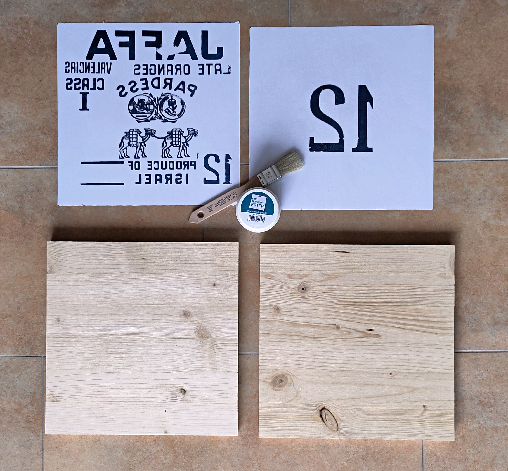
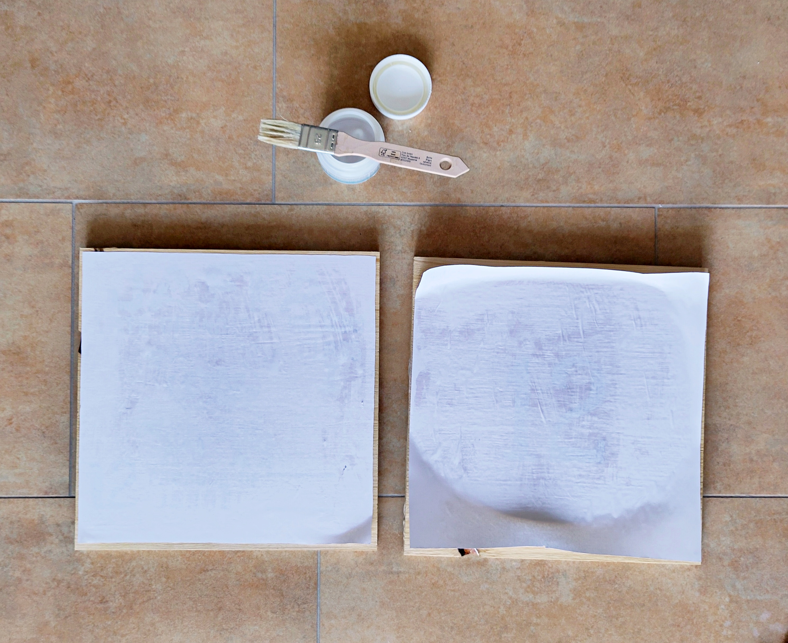
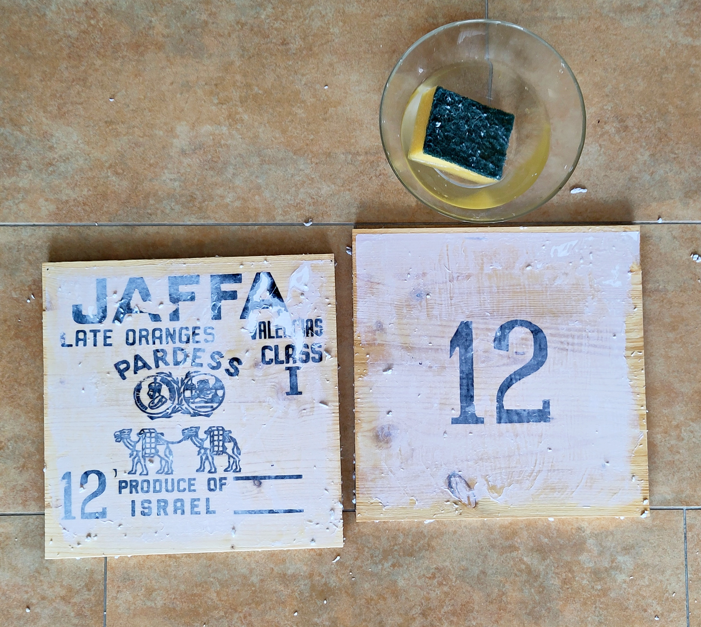

# Nachbildung einer Obstkiste im Vintage-Stil

Vor einigen Jahren habe ich diese alte Holzkiste in einem Dachstock entdeckt, voll von Staub und Spinnennetzen. Mal gereinigt stellte sich heraus, dass sie sich hervorragen als Schallplattenregal eignet.

Ich habe eine Weile auf dem Internet gesucht und konnte keine weitere solche Kiste auftreiben, also habe ich mir kurzerhand selbst eine gebaut. Diese Kisten sind so genial einfach gebaut, dass es einfach Spass macht, selbst eine zu zimmern.

Das Holz könnt ihr im Baumarkt zuschneiden lassen. Dort gibt es auch den Foto Transfer Gel und Klarlack zu kaufen; falls ihr am Schluss das Holz lackieren wollt. Bevor ihr euch auf den Weg zum Baumarkt macht, klärt bitte ab, ob der Foto Transfer Gel vorrätig ist.

Die Kosten waren ca. 40 EUR, wobei der Holzzuschnitt die Hauptkosten verursachte.

**Supplies**

2 Laserdruck, max. 30x30 cm

1 Foto Transfer Gel, min. 50 ml

1 Klarlack für Holz, min 50 ml

1 Massivholz Fichte 700x300x12 mm

3 Massivholz Fichte 300x300x15 mm

4  Sperrholz Fichte 700x130x6.5 mm

33 Nagel 1.8x35 mm

## 1 Foto Transfer

Das Holz und der Laserdruck sind mit dem Foto Transfer Medium satt einzustreichen. Dann legt ihr das Papier auf das Holz und drückt vorsichtig alle Luftbläschen raus.

Wartet dann 24 Stunden.

Mit einem feuchten Schwamm könnt ihr dann das Papier abrubbeln. Die Farbe ist in der Schicht des getrockneten Gels und wird dabei nicht abgewaschen.

Ich habe das zum ersten Mal gemacht und würde das nächste Mal die Drucke nicht ausschneiden wie es den Fotos zu sehen ist. Ich würde die gesamte Holzplatte mit dem Gel bestreichen und mit dem Ausdruck bedecken, so dass es eine gleichmässige Gelschicht über die ganz Platte gibt.

## Zimmern - Massive Wand

Die Vorder- und Rückwand und die Mittelwand werden mit jeweils 3 Nägeln befestigt. Die Nägel werden im Abstand von 40 mm zur Seitenkante und 7.5 mm zur Ober- und Unterkante eingeschlagen.

## Zimmern - Gegenüberliegende Wand

Auf der Seite gegenüber der Massivholzwand wird das vordere Sperrholzbrett bündig zur vorderen Kante befestigt. Das hintere Sperrholzbrett wird mit 20 mm Abstand zur hinteren Kante befestigt.

Die Nägel werden im Abstand von 15 mm zur Seitenkante und 7.5 mm zur Ober- und Unterkante eingeschlagen.

## Zimmern - Rückwand

Auf der Seite welche die Rückwand des Regals bildet wird das vordere Sperrholzbrett mit 14 mm Abstand zur Kante befestigt. Den Spalt zwischen der Massivholzwand und dem hinteren Sperrholzbrett wird 8 mm offen gelassen.

Die Nägel werden im Abstand von 15 mm zur Seitenkante und 7.5 mm zur Ober- und Unterkante eingeschlagen.

## Fertigstellen

Zu Schutz könnt ihr das Holz mit dem Klarlack einstreichen. Ich habe nur die bedruckten Seiten mit dem Lack geschützt.

Das ist die Nachbildung einer Obstkiste im Vintage-Stil.

