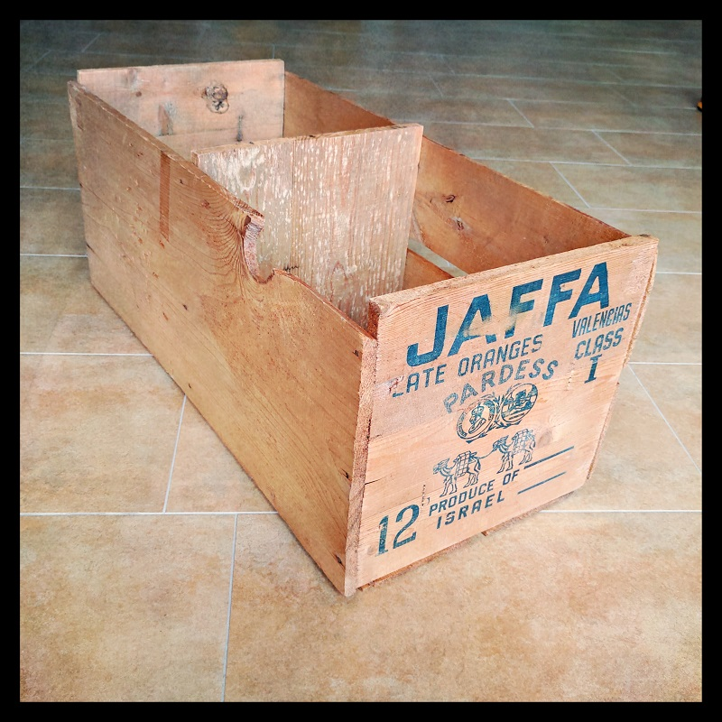
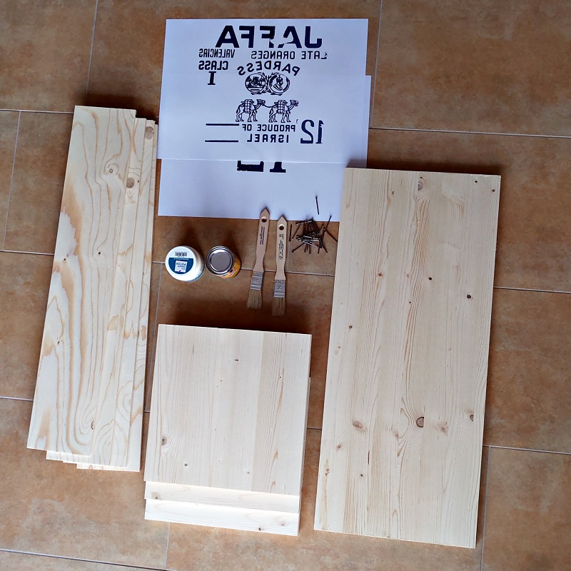
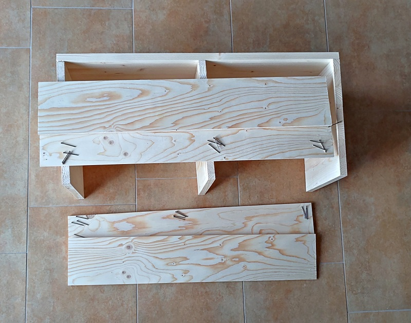

# Replica of a vintage fruit crate

A few years ago I discovered this old wooden box in an attic, covered in dust and spider webs. Once cleaned, it turned out to be an excellent shelf for LPs.

I've searched the internet for a while and couldn't find another box like this, so I made my own without further ado. These boxes are built so ingeniously simply that it's just fun to build one yourself.

You can have the wood cut at the hardware store. There you can also buy the photo transfer medium and clear varnish; if you want to varnish the wood at the end. Before you make your way to the hardware store, please clarify whether the photo transfer medium is in stock.

The cost was around 40 EUR, with the wood cutting being the main cost.

**Supplies**

2 laser printing, max. 30x30 cm

1 photo transfer medium, min. 50 ml

1 clear varnish for wood, min 50 ml

1 solid spruce wood 700x300x12 mm

3 solid spruce wood 300x300x15 mm

4 spruce plywood 700x130x6.5 mm

33 nail 1.8x35 mm

## 1 Photo Transfer

The wood and the laser print are to be generously coated with the photo transfer medium. Then you put the paper on the wood and carefully squeeze out all the air bubbles.

Then wait 24 hours.

You can then rub off the paper with a damp sponge. The color is in the layer of dried medium and is not washed off.

I made this for the first time and next time I would not cut out the prints as shown on the photos. I would coat the entire wooden board with the medium and cover it with the printout, so that there is an even layer of medium over the whole board.

## Timber - Solid Wall

The front and the rear walls and the middle wall are each attached with 3 nails. The nails are hammered in at a distance of 40 mm from the side edge and 7.5 mm from the top and bottom edges.

## Timber - Opposite Wall

On the side opposite the solid wood wall, the front plywood board is attached flush to the front edge. The rear plywood board is attached 20 mm from the rear edge.

The nails are hammered in at a distance of 15 mm from the side edge and 7.5 mm from the top and bottom edges.

## Timber - Back Wall

On the side that forms the back wall of the shelf, the front plywood board is attached with a distance of 14 mm to the edge. The gap between the solid wood wall and the back plywood board is left 8 mm open.

The nails are hammered in at a distance of 15 mm from the side edge and 7.5 mm from the top and bottom edges.

## Finalize

You can coat the wood with clear varnish to protect it. I only protected the printed sides with the varnish.

This is the replica of a vintage fruit crate.

